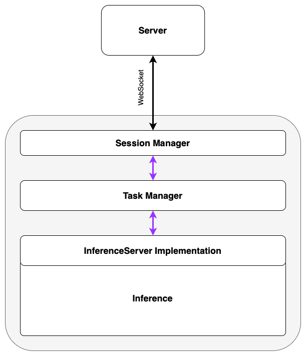

# Project GenAi client node

Node is the serving component of the [project](https://paipe.io/) backend: an image generation and pipeline builder infrastructure as a service. Node is hosted on the client side and interacts with the [server](https://github.com/paipe-labs/project-genai/) as follows:
- node recieves an image generation request 
- node performs the task generation, using client computing resources
- node sends the generation result to the server

Node components:
- `SessionManager` class acts as a coordinator: it establishes a session by creating a WebSocket connection to the server and serves the process of data flow between the server and the node
- `TasksManager` class is responsible for creating and managing image generation tasks
- `InferenceServer` class declares the interface of interaction with Inference. Currently the following types are available depending on the type of inference:
    - `AutomaticInferenceServer`
    - `ComfyUIInferenceServer`
    - `VoltaMLInferenceServer`
    - `TestInferenceServer`

  

# Inference
Inference is a node part responsible for the image generation process. [Сog-comfyui](https://github.com/fofr/cog-comfyui) and [ai-dock comfyui](https://github.com/ai-dock/comfyui/) are integrated into node component as base Docker images - configuration can be found in `build` directory.
